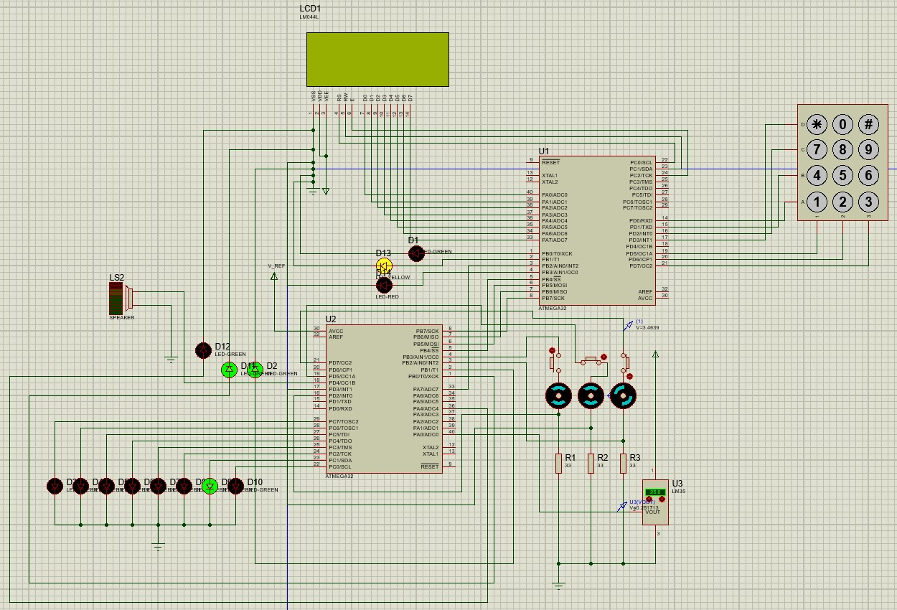

  <h1><strong>Temperature control system using two Atmega32 microcontrollers (master/slave)</strong></h1>
  
<strong>A system which has been designed to control temperature of a server. This system consists of two Atmega32, one as a control panel (called Master) and one as a controlling unit (called Slave). These two units communicate with each other and control working condition of fans based on the situation by considering temperatire, fans' condition, and user's specification.</strong>

**System Overview**

**Hardware Components**

-   **Atmega32 Microcontrollers:** Master unit handles user interface; Slave unit manages temperature control.
-   **LCD Screen:** Connected to PORTA on the Master, displays menus and system information.
-   **Keypad:** Connected to PORTD on the Master, used for password entry and menu navigation.
-   **LED Indicator:** Connected to PORTB on the Master, indicate system status.
-   **Temperature Sensor (LM35):** Connected to ADC0 on the Slave, measures server temperature.
-   **Motors:** Controlled via Timer/Counter 0, 1A, and 2 on the Slave, manage cooling based on temperature.
-   **Speaker for Alarm:** Uses Timer/Counter 1B and Fast PWM on the Slave to generate sound.

**Software Design**

-   **Password Entry and Verification:**
    -   User enters a password via the keypad.
    -   The Master transmits the encrypted password to the Slave using SPI.
    -   The Slave decrypts the password and verifies it.
    -   The Slave sends a response back to the Master indicating success or failure.
-   **Temperature Monitoring and Motor Control:**
    -   The Slave reads temperature data from the LM35 sensor connected to ADC0.
    -   Motor duty cycles are adjusted based on the temperature:
        -   Duty cycle increases by 10% per 10°C.
        -   If motors are disconnected via switches, the duty cycle is redistributed among the connected motors.
-   **Alarm System:**
    -   If a critical error occurs, the Master activates the speaker using Timer/Counter 1B and Fast PWM to generate an alarm.
-   **LCD Display:**
    -   Displays system menus, current temperature, and motor status.
-   **LED Indicators:**
    -   Green LED: Normal operation.
    -   Yellow LED: One or two motors failed.
    -   Red LED: Critical error (all motors failed or insufficient cooling capacity).

**System Functionality**

-   **Initial Lock State:** System is locked and prompts for a password on the LCD.
-   **Password Entry and Verification:** User enters the password; the Master sends it to the Slave for verification.
-   **System Start:** On successful password verification, the system unlocks and the Slave starts sending data to the Master.
-   **Motor Control Logic:**
    -   Motors are controlled based on the temperature read from the LM35 sensor.
    -   Duty cycle adjustments:
        -   10% per 10°C per motor.
        -   Redistribution of duty cycle if motors are disconnected.
-   **Error Handling:**
    -   Display error messages on the LCD.
    -   Activate LED indicators and speaker alarm.

**User Interface**

-   **LCD Display:**
    -   Main menu with options for checking motor status and temperature.
    -   Motor status menu shows individual motor information (working status and duty cycle).
    -   Temperature menu displays the current temperature.
-   **Keypad:**
    -   Used for password entry and menu navigation.
-   **LED Indicators:**
    -   Green: Everything is functioning normally.
    -   Yellow: One or two motors failed.
    -   Red: Critical error.
-   **Speaker:**
    -   Activated for alarms using Fast PWM on Timer/Counter 1B.

**Communication Protocol**

-   **SPI Communication:**
    -   Master and Slave communicate via SPI without interrupt.
    -   Passwords are encrypted using AES before transmission.
    -   The Slave decrypts and verifies the password.
    -   Communication includes commands for password verification, temperature data requests, and motor status updates.

**Other Features**

-   **Password Attempts and Lockout Mechanism:**
    -   After three incorrect password attempts, the system locks the user out for 30 seconds.
-   **Encrypted Communication:**
    -   AES encryption ensures secure password transmission.
-   **Alarm System:**
    -   Activated for critical errors using the speaker connected to PORTD on the Master.
